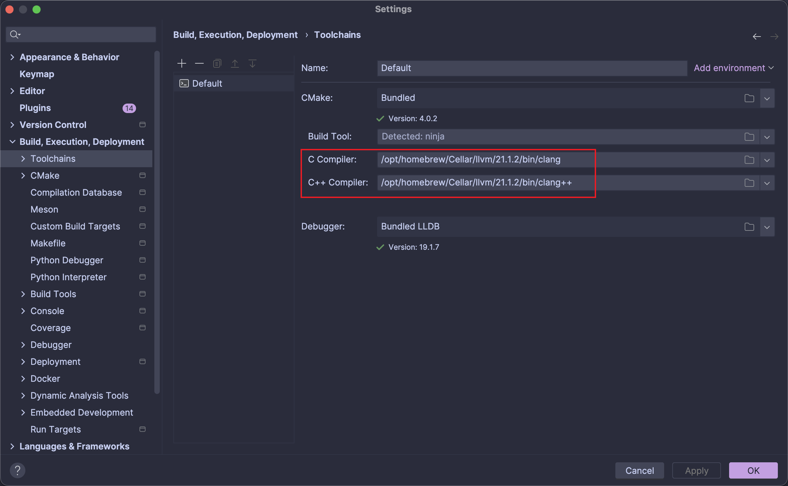

# RuiAnalysis

## Configurations

### Install Packages

```sh
brew install cmake # cmake
brew install ninja # ninja
brew install llvm # llvm
brew install nlohmann-json # nlohmann::json
```

### Set Environment Variables

```sh
# Headers and libraries
export CPPFLAGS="-I/opt/homebrew/opt/llvm/include"
export LDFLAGS="-L/opt/homebrew/opt/llvm/lib"

# Mac SDKs
export SDKROOT=$(xcrun --show-sdk-path)
```

### IDE

[Clion](https://www.jetbrains.com/clion/)

**CMake Configurations**

```
Clang_DIR = /opt/homebrew/Cellar/llvm/21.1.2/lib/cmake/clang
LLVM_DIR = /opt/homebrew/Cellar/llvm/21.1.2/lib/cmake/llvm
```


**Toolchains Configurations**

```
C Compiler = /opt/homebrew/Cellar/llvm/21.1.2/bin/clang
C++ Compiler = /opt/homebrew/Cellar/llvm/21.1.2/bin/clang++
```



## Instructions

```sh
# 1. clone project
git clone https://github.com/ruizhengu/RuiAnalysis.git
# 2. go to root dir
cd RuiAnalysis
# 3. build project with Clion
# 4. run project with test file
cmake-build-debug/RuiAnalysis ./examples
```

